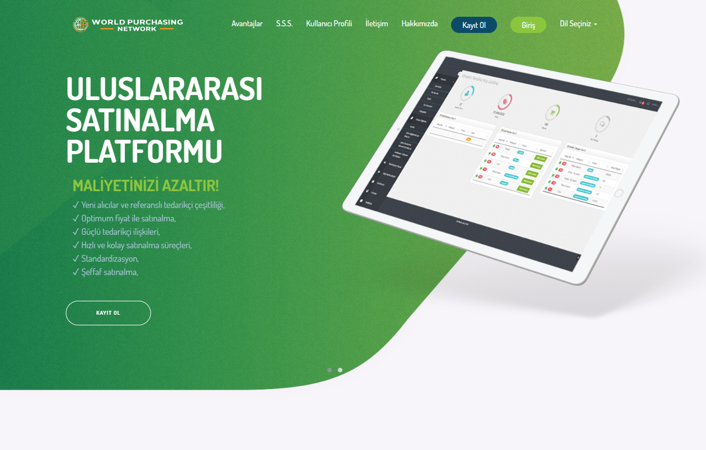
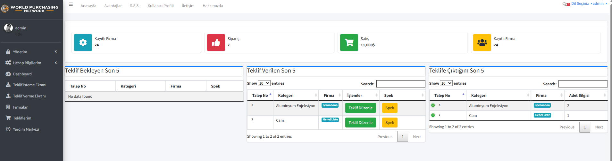
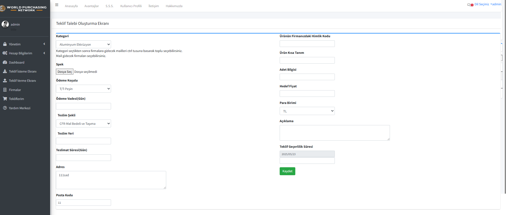

# worldpurnet

Bu depo, worldpurnet projesinin kaynak kodunu içermektedir.

## Kurulum

Projeyi yerel sunucunuzda (örn: XAMPP) çalıştırmak için aşağıdaki adımları izleyin:

1. Bu depoyu klonlayın veya indirin.
2. Proje dosyalarını XAMPP htdocs klasörünüze (`C:\xampp\htdocs\worldpurnet`) yerleştirin.
3. phpMyAdmin'i kullanarak `u1750718_kozmonotor (1).sql` dosyasını içe aktararak veritabanını oluşturun.
4. `Connections/baglan.php` dosyasındaki veritabanı bağlantı bilgilerini güncelleyin (şu anki bilgiler dosyada mevcut olmalı, kontrol edin).
5. Tarayıcınızdan projeye erişin (genellikle `http://localhost/worldpurnet`).

## Kullanım

Projenin nasıl kullanılacağına dair bilgiler...

## Görseller

Projenin farklı bölümlerini gösteren ekran görüntüleri:

## Lisans

Bu proje açık kaynaklıdır ve [Lisans Adı] lisansı altında dağıtılmaktadır. (Uygun lisansı belirtin veya bu bölümü kaldırın.) 
